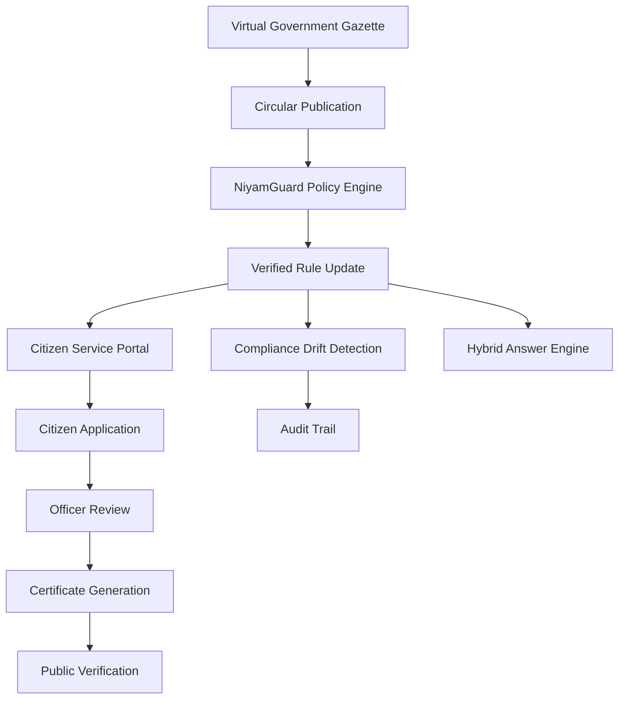

# NiyamGuard AI - Complete Project Audit and Technical Report

Project Type: Virtual Government Policy Compliance and Public Service Operating Platform  
Repository: `https://github.com/badugujashwanth-create/NiyamGuard`  
Local Path: `D:\niyam\niyamguard-call-assistant`  
Branch: `codex/self-updating-policy-engine`  
Latest Commit: `27d70c6 Update final report with PR link`  
Implementation Baseline Commit Referenced By Final Report: `f1e81e2 Add hybrid answer engine and pilot sandbox`  
Report Generated On: 2026-07-10  

---

## 1. Project Title

NiyamGuard AI - Complete Project Audit and Technical Report

This report audits the current NiyamGuard repository as a virtual government policy compliance and public service operating platform. It documents the implemented backend APIs, frontend pages, service workflows, policy engine, virtual government sandbox, tests, demo assets, limitations, and readiness state.

---

## 2. Executive Summary

NiyamGuard AI is a pilot-ready virtual government platform for policy compliance, citizen service workflows, officer review, certificate generation, public verification, compliance drift detection, audit records, and source-backed citizen answers.

NiyamGuard started as a circular compliance checker. In its current state, it has evolved into a full virtual government operating platform. It can demonstrate how a policy circular moves into verified rules, how those rules affect citizen services, how officers review applications, how demo certificates are issued, how public verification works, and how departments can detect connected systems that still show stale rules.

NiyamGuard is a pilot-ready virtual government platform that keeps circulars, verified policy rules, citizen services, officer workflows, certificates, public verification, compliance checks, and audit records synchronized.

This is a virtual government sandbox and MeeSeva-style prototype, not an official government portal. It does not submit real applications to government systems, does not process real payments, does not send real OTPs, and does not connect to an official certificate authority.

The system is strongest as a hackathon/pilot demonstration platform: it has a complete end-to-end story, working frontend pages, backend APIs, role-based login, source-backed answers, virtual scenario runner, tests, smoke checks, and recording assets.

---

## 3. Problem Statement

Government departments release circulars and policy updates, but many citizen-facing portals, internal officer workflows, forms, certificates, FAQ pages, and connected systems may not update at the same time.

Key real-world pain points:

- Policy circulars are released, but implementation is delayed.
- Different portals may show old rules.
- Citizens may follow outdated instructions.
- Officers may process applications using old criteria.
- Certificates may be generated using outdated validity rules.
- Departments may not know which systems are out of sync.
- There is often no clear audit trail from circular to system update.
- AI-only answers can hallucinate and are not safe for official policy decisions.

A government-grade system needs verified rule tracking, source-backed answers, compliance drift detection, citizen service workflows, officer review, audit trails, and controlled sandbox testing before real API integration.

NiyamGuard addresses this by combining deterministic verified rules, policy publication workflows, compliance checks, citizen/officer/admin portals, public verification, and an optional AI layer that is restricted to explanation and retrieval-backed assistance.

---

## 4. Initial Idea vs Current Platform

| Area | Initial Idea | Current Implementation | Impact |
| --- | --- | --- | --- |
| Scope | Circular compliance checker. | Virtual government operating platform with policy, portal, officer, certificate, verification, audit, AI, readiness, and sandbox flows. | Much stronger end-to-end demo story. |
| Circular handling | Read or compare circular data. | Circular sources, sync, upload, extraction, rule candidates, approval, publication, history, versions, propagation, rollback. | Shows the complete policy lifecycle. |
| Compliance checking | Detect mismatches. | Compliance findings, drift status, severity, priority, cascade tracing, conflict detection, reruns, reports, exports. | Gives officials actionable risk visibility. |
| Citizen portal | Not central in the original idea. | `/services`, service details, apply flow, document upload, payment sandbox, tracking, notifications, certificate views. | Demonstrates citizen impact and usability. |
| Officer portal | Not central in the original idea. | `/officer`, pending/approved/rejected/escalation queues, approve/reject/request documents, comments, certificate generation. | Demonstrates administrative workflow. |
| Certificate generation | Not part of initial checker. | Demo certificate numbers, verification hashes, generated local certificate files, public verification endpoint. | Closes the service lifecycle. |
| Public verification | Not part of initial checker. | `/verify-certificate`, `/api/certificates/verify/{query}`, privacy-safe verification response. | Gives public trust and anti-fraud story. |
| AI/answer system | Possible assistant. | Exact rule engine, decision tables, RAG/BM25/semantic search, optional Ollama/local LLM, deterministic fallback, source cards. | Reduces hallucination risk. |
| Government API dependency | Would need official APIs to prove value. | Virtual government sandbox and mock connected systems replace missing official APIs for pilot testing. | Demo works without external government access. |
| Audit trail | Basic logging idea. | Audit events, audit routes, hash-chain verification, action/event tracking across workflows. | Supports traceability. |
| Demo readiness | Partial. | `/demo`, final walkthrough docs, smoke test, screenshots, WebM assets. | Ready for presentation. |
| Production readiness | Conceptual. | Production-style prototype with clear remaining gaps for official deployment. | Honest pilot-to-production path. |

---

## 5. Complete System Overview

The implemented system flow is:

```text
Virtual Government Gazette
down
Circular Publication
down
NiyamGuard Circular Ingestion
down
Verified Rule Update
down
Service Portal Update
down
Citizen Application
down
OTP / Identity / Payment Sandbox
down
Officer Review
down
Certificate Generation
down
Virtual Certificate Authority Signing
down
Public Certificate Verification
down
Compliance Drift Detection
down
Audit Trail and Reports
down
Hybrid Intelligence Answer Engine
```

Mermaid view:



Important implementation note: the current frontend has a single `/virtual-gov` page for the sandbox. Separate pages such as `/virtual-gov/gazette`, `/virtual-gov/identity`, `/virtual-gov/otp`, `/virtual-gov/payments`, `/virtual-gov/cert-authority`, `/virtual-gov/document-vault`, `/virtual-gov/integration-monitor`, and `/virtual-gov/scenario-runner` were not found as separate frontend routes. The functions are represented through the backend sandbox scenario, readiness APIs, service portal flows, payment sandbox, certificate verification, and demo dashboard.

---

## 6. Architecture Overview

### Backend

The backend is a FastAPI application in `backend/app/main.py`. It includes:

- FastAPI route modules for auth, forms, assistant, chat, AI, compliance, policy update, service portal, virtual government, audit, reports, readiness, and dataset APIs.
- Middleware for API version aliasing, security headers, request logging, request IDs, trusted hosts, CORS, and structured error handling.
- Service layer modules for auth, service portal, policy publication, circular ingestion, compliance, propagation, readiness, virtual government, hybrid answer, AI providers, audit, reports, and dataset/RAG operations.
- Pydantic models for form schemas, policy rules, compliance findings, self-update objects, service portal entities, virtual scenario results, and session/assistant payloads.
- SQLAlchemy records for users, refresh tokens, audit events, policy records, and dataset records.
- A JSON-backed `PolicyDataStore` demo store for seeded virtual government/service data.
- Tests under `backend/app/tests`.

### Frontend

The frontend is a React/Vite app in `frontend/`. It includes:

- Simple route selection in `frontend/src/App.jsx` based on `window.location.pathname`.
- Citizen voice/form assistant and service catalog.
- Service portal at `/services`, `/apply`, `/applications`, `/track`, `/verify-certificate`, `/payment`, `/officer`, and related citizen routes.
- Admin portal at `/admin` with dashboard, compliance, policy update, propagation, scheduler, readiness, audit, reports, users, regulatory AI, services/forms/certificates, and other pages.
- Demo dashboard at `/demo`, including the "How everything works" presentation section and `Run Full Virtual Government Demo` button.
- Virtual government sandbox page at `/virtual-gov`.
- Mock connected system pages at `/mock/meeseva` and `/mock/public-faq`.
- Source/method badges in the assistant and demo pages.

### Runtime Ports Used In Latest Verification

```text
Backend: http://127.0.0.1:8010
Frontend: http://127.0.0.1:5180
```

The default README also documents local defaults of backend `8000` and frontend `5173`. The final presentation run used `8010` and `5180`.

---

## 7. Backend Feature Audit

### 7.1 Auth and RBAC

What it does:

Auth provides login, refresh, logout, current-user lookup, user creation, user listing, and user updates. RBAC protects admin, reviewer/officer, viewer, and citizen workflows.

Why it is needed:

Government-style systems must separate public access, citizen access, officer review access, and admin control-room access.

Technical implementation:

- `backend/app/routes/auth_routes.py`
- `backend/app/services/auth_service.py`
- `backend/app/security/rbac.py`
- `backend/app/security/jwt.py`
- `backend/app/security/password.py`
- `backend/app/repositories/auth_repository.py`
- `backend/app/models/auth_models.py`
- `backend/app/schemas/auth_schemas.py`

Main APIs/routes:

- `POST /api/auth/login`
- `POST /api/auth/logout`
- `POST /api/auth/refresh`
- `GET /api/auth/me`
- `POST /api/auth/users`
- `GET /api/auth/users`
- `PATCH /api/auth/users/{user_id}`

User/admin usage:

- Citizens log in for applications and profile/document access.
- Officers/reviewers log in for review queues and approvals.
- Admin users manage system data, compliance, readiness, users, reports, and policy updates.

Demo accounts:

```text
Admin: admin@niyamguard.local / Admin@12345
Officer: officer@niyamguard.local / Officer@12345
Citizen: citizen@niyamguard.local / Citizen@12345
Reviewer: reviewer@niyamguard.local / Reviewer@12345
Viewer: viewer@niyamguard.local / Viewer@12345
```

Current status:

Implemented. JWT tokens and role checks are used through FastAPI dependencies. Audit events are recorded for login success/failure, logout, user creation, and user updates.

Limitations:

This is suitable for a prototype. Production needs hardened password policy, real identity provider integration, account lifecycle controls, lockout policy, secrets management, and security review.

### 7.2 Service Portal Backend

What it does:

Provides a synthetic public service portal with service catalog, service details, dynamic forms, application drafts, document upload, submission, application tracking, notifications, citizen profile, and payment/certificate integration.

Why it is needed:

It shows how a verified government rule affects an actual citizen service workflow rather than remaining only in an admin compliance dashboard.

Technical implementation:

- `backend/app/routes/service_portal_routes.py`
- `backend/app/services/service_portal_service.py`
- `backend/app/models/service_portal_models.py`
- `PolicyDataStore.service_definitions`
- `PolicyDataStore.service_form_definitions`
- `PolicyDataStore.service_slas`

Main APIs/routes:

- `GET /api/portal/services`
- `GET /api/portal/services/{service_id}`
- `GET /api/portal/services/{service_id}/form`
- `GET /api/citizen/profile`
- `PATCH /api/citizen/profile`
- `GET /api/citizen/documents`
- `POST /api/applications`
- `GET /api/applications`
- `GET /api/applications/{application_id}`
- `PATCH /api/applications/{application_id}`
- `POST /api/applications/{application_id}/documents`
- `POST /api/applications/{application_id}/submit`
- `GET /api/applications/{application_id}/status-history`
- `GET /api/applications/{application_id}/sla`
- `GET /api/track/{application_number}`
- `GET /api/notifications`

User/admin usage:

- Citizens browse services, apply, upload documents, submit, pay in sandbox mode, track status, and view notifications.
- Officers and admins see applications through officer/admin routes.

Current status:

Implemented with ten seeded services:

- Income Certificate
- Residence Certificate
- Caste Certificate
- EWS Certificate
- Birth Certificate
- Death Certificate
- Family Member Certificate
- Ration Card
- Old-Age Pension
- Post-Matric Scholarship

Limitations:

The portal is synthetic. It does not submit official MeeSeva applications or integrate with real document vaults, eKYC, payments, or official department systems.

### 7.3 Officer Review Backend

What it does:

Provides officer queues, assignment, application review, document requests, approval, rejection, comments, and certificate generation trigger.

Why it is needed:

Policy compliance is not only citizen-facing. Officers need a controlled workflow to review evidence and make decisions based on current verified rules.

Technical implementation:

- `service_portal_service.officer_queue`
- `assign_application`
- `request_documents`
- `approve_application`
- `reject_application`
- `add_comment`
- `get_application_sla`
- `OfficerReview`, `ApplicationAssignment`, `ApplicationComment`, `ServiceSLA`

Main APIs/routes:

- `GET /api/officer/applications`
- `GET /api/officer/applications/{application_id}`
- `GET /api/officer/pending`
- `GET /api/officer/approved`
- `GET /api/officer/rejected`
- `GET /api/officer/escalations`
- `POST /api/officer/applications/{application_id}/assign`
- `POST /api/officer/applications/{application_id}/request-documents`
- `POST /api/officer/applications/{application_id}/approve`
- `POST /api/officer/applications/{application_id}/reject`
- `POST /api/officer/applications/{application_id}/comment`

User/admin usage:

Officer logs in, opens `/officer`, reviews pending applications, approves/rejects, requests more documents, and triggers certificate issue when approving.

Current status:

Implemented.

Limitations:

This is not connected to a real government officer identity provider or official workflow engine.

### 7.4 Certificate Backend

What it does:

Generates demo certificate records, certificate numbers, QR-style verification values, verification hashes, local certificate files, and public verification logs.

Why it is needed:

The platform needs to prove the service lifecycle ends with a verifiable output, not only an internal approval.

Technical implementation:

- `Certificate`
- `CertificateVerificationLog`
- `service_portal_service.approve_application`
- `service_portal_service.verify_certificate`
- `service_portal_service.get_certificate_bytes`
- `CERTIFICATE_STORAGE_DIR`

Main APIs/routes:

- `GET /api/certificates/{certificate_id}`
- `GET /api/certificates/{certificate_id}/download`
- `GET /api/certificates/verify/{verification_query}`
- `GET /api/verify-certificate/{verification_query}`
- `POST /api/certificates/{certificate_id}/revoke`

User/admin usage:

- Officer approval generates the certificate.
- Citizen can view/download a generated demo certificate.
- Public users can verify certificate number or hash.

Current status:

Implemented as a virtual certificate authority flow. Certificates are synthetic demo artifacts.

Limitations:

No real certificate signing authority is connected. Generated certificate files are text/PDF-like demo files stored locally and ignored by Git.

### 7.5 Self-Updating Policy Engine

What it does:

Implements circular source sync, circular document storage, rule candidate extraction, approval/rejection, verified rule publication, versioning, knowledge update events, propagation tasks, compliance reruns, rollback, and mock system patching.

Why it is needed:

It demonstrates how policy changes move from a circular into operational systems and how drift can be detected.

Technical implementation:

- `backend/app/routes/source_routes.py`
- `backend/app/routes/circular_routes.py`
- `backend/app/routes/rule_candidate_routes.py`
- `backend/app/routes/policy_update_routes.py`
- `backend/app/routes/knowledge_update_routes.py`
- `backend/app/routes/propagation_routes.py`
- `backend/app/routes/scheduler_routes.py`
- `backend/app/routes/demo_self_update_routes.py`
- `backend/app/services/circular_sync_service.py`
- `backend/app/services/circular_ingestion_service.py`
- `backend/app/services/rule_extraction_service.py`
- `backend/app/services/rule_delta_service.py`
- `backend/app/services/policy_publication_service.py`
- `backend/app/services/knowledge_update_service.py`
- `backend/app/services/propagation_service.py`
- `backend/app/services/scheduler_service.py`
- `backend/app/models/self_update_models.py`

Main APIs/routes:

- `GET /api/sources`
- `POST /api/sources`
- `PATCH /api/sources/{source_id}`
- `POST /api/sources/{source_id}/sync`
- `GET /api/circulars`
- `POST /api/circulars/sync-all`
- `POST /api/circulars/upload`
- `POST /api/circulars/{circular_id}/extract-rules`
- `GET /api/rule-candidates`
- `POST /api/rule-candidates/{candidate_id}/approve`
- `POST /api/rule-candidates/{candidate_id}/reject`
- `POST /api/policy-updates/{candidate_id}/publish`
- `GET /api/policy-updates/history`
- `GET /api/policy-updates/versions`
- `POST /api/policy-updates/rules/{rule_id}/rollback`
- `GET /api/knowledge/update-events`
- `POST /api/knowledge/reindex`
- `GET /api/propagation/tasks`
- `POST /api/propagation/tasks/{task_id}/apply-demo-patch`
- `GET /api/scheduler/status`
- `POST /api/scheduler/run-now`
- `POST /api/demo/run-self-update-scenario`

User/admin usage:

Admins use `/admin/sources`, `/admin/circulars`, `/admin/rule-candidates`, `/admin/policy-updates`, `/admin/propagation`, and `/admin/scheduler`.

Current status:

Implemented for demo sources and deterministic policy extraction/publication. The GO-138 income certificate validity scenario is the primary demo case.

Limitations:

The system does not connect to live official circular feeds unless configured and approved. Extraction is demo-oriented and deterministic for the seeded scenario.

### 7.6 Compliance Drift Detection

What it does:

Compares verified rules against connected system snapshots and detects drift, severity, priority, conflicts, cascade impact, and report data.

Why it is needed:

Departments need to know which systems are still showing old rules after a circular changes official policy.

Technical implementation:

- `backend/app/routes/compliance_routes.py`
- `backend/app/routes/compliance_update_routes.py`
- `backend/app/routes/connected_system_routes.py`
- `backend/app/routes/conflict_routes.py`
- `backend/app/routes/cascade_routes.py`
- `backend/app/routes/dashboard_routes.py`
- `backend/app/routes/report_routes.py`
- `backend/app/services/compliance_service.py`
- `backend/app/services/compliance_orchestrator_service.py`
- `backend/app/services/connected_system_service.py`
- `backend/app/services/conflict_detector.py`
- `backend/app/services/cascade_trace_service.py`
- `backend/app/services/priority_service.py`
- `backend/app/services/report_service.py`

Main APIs/routes:

- `POST /api/compliance/run`
- `GET /api/compliance/findings`
- `GET /api/compliance/findings/{finding_id}`
- `GET /api/compliance/service/{service_id}`
- `GET /api/compliance/system/{connected_system_id}`
- `POST /api/compliance/findings/{finding_id}/mark-fixed`
- `POST /api/compliance/rerun-for-rule/{rule_id}`
- `GET /api/compliance/runs`
- `GET /api/connected-systems`
- `POST /api/connected-systems`
- `POST /api/connected-systems/{system_id}/snapshots`
- `POST /api/conflicts/scan`
- `GET /api/conflicts`
- `POST /api/conflicts/{conflict_id}/resolve`
- `POST /api/conflicts/{conflict_id}/ignore`
- `GET /api/cascade/finding/{finding_id}`
- `GET /api/dashboard/summary`
- `GET /api/dashboard/priority-findings`
- `GET /api/reports/export`

User/admin usage:

Admins open `/admin/compliance`, `/admin/cascade`, `/admin/conflicts`, `/admin/reports`, `/admin/impact`, and `/admin/scale-view`.

Current status:

Implemented. Seeded connected systems include MeeSeva portal, officer SOP, public FAQ, simplified citizen form, and scholarship portal checker.

Limitations:

The connected systems are snapshots/mocks. Real portal scanning and official system patching require government integration.

### 7.7 Virtual Government Sandbox

The virtual government sandbox is implemented primarily through `/virtual-gov`, `/api/virtual-gov/*`, service portal flows, sandbox payment, certificate generation, audit, and readiness/MFA APIs.

#### Virtual Government Gazette

What it simulates:

Publication of demo circulars such as GO-138.

How it connects:

Circular source and policy update modules ingest demo circular data and produce verified rule candidates.

How to test:

Open `/admin/sources`, `/admin/circulars`, or run the scenario from `/virtual-gov`.

Value:

Lets government teams test circular-to-rule workflow before official feeds exist.

#### Virtual Identity Provider

What it simulates:

Role identities for admin, reviewer/officer, viewer, and citizen users.

How it connects:

Seeded auth users and JWT/RBAC enforce access boundaries.

How to test:

Log in with demo accounts at `/login`.

Value:

Proves role-based workflows without a real identity provider.

#### Virtual OTP/SMS Provider

What it simulates:

Sandbox OTP request and verification.

How it connects:

Readiness routes expose deterministic demo OTP behavior.

How to test:

Use `POST /api/security/otp/request` and `POST /api/security/otp/verify` with demo code `123456`.

Value:

Shows MFA readiness while clearly avoiding real SMS/email.

#### Virtual Payment Gateway

What it simulates:

Sandbox payment creation, success, and failure.

How it connects:

Service portal payment APIs update fee status and application status.

How to test:

Use `/payment/{application_id}` or `POST /api/payments/{payment_id}/simulate-success`.

Value:

Demonstrates paid service workflows without real money movement.

#### Virtual Certificate Authority

What it simulates:

Certificate issue, verification hash, QR-style value, and certificate status.

How it connects:

Officer approval generates a `Certificate` record and verification hash.

How to test:

Approve an application or run `/api/virtual-gov/run`, then verify the returned hash.

Value:

Shows the end state of service delivery.

#### Virtual Document Vault

What it simulates:

Citizen document upload and stored document metadata.

How it connects:

Document upload validates PDF/JPG/PNG and stores files under `backend/app/storage/documents/`.

How to test:

Upload documents during `/apply/income_certificate`.

Value:

Shows evidence collection without using real document vault APIs.

#### Virtual Integration Monitor

What it simulates:

System readiness, integration health, connected system drift, and ops status.

How it connects:

Readiness, ops, integration health, compliance, and mock system APIs.

How to test:

Open `/admin/readiness`, `/demo`, or call `/api/ops/status` and `/api/integration/health`.

Value:

Shows government pilot controls and dependency state.

#### Scenario Runner

What it simulates:

End-to-end regulation question, application, documents, submission, payment, officer approval, certificate, verification, and dataset context.

How it connects:

`virtual_government_service.run_scenario` calls hybrid answer, service portal, payment, officer approval, certificate verification, and dataset demo flow.

How to test:

Open `/virtual-gov` and click `Run Sandbox Scenario`, or call `POST /api/virtual-gov/run`.

Value:

Gives a single reliable presentation path.

### 7.8 Hybrid Answer Engine

What it does:

Answers citizen and admin questions using deterministic, source-backed methods before using optional AI.

Why it is needed:

Official answers must not be based on unverified LLM generation. NiyamGuard needs explainable and source-backed outputs.

Technical implementation:

- `backend/app/routes/hybrid_intelligence_routes.py`
- `backend/app/services/hybrid_intelligence/hybrid_answer_service.py`
- `exact_rule_answerer.py`
- `decision_table_answerer.py`
- `rag_retriever.py`
- `local_llm_answerer.py`
- `answer_validator.py`
- `answer_composer.py`
- `source_card_builder.py`
- `confidence_scorer.py`
- `question_router.py`
- `intent_detector.py`
- `language_detector.py`

Flow:

```text
Question
-> language detection
-> intent detection
-> question router
-> exact rule engine / application lookup / certificate lookup / decision table / RAG / local LLM
-> answer validation
-> source cards
-> composed safe answer
-> deterministic fallback if invalid or unsupported
```

Main APIs/routes:

- `POST /api/hybrid/answer`
- `POST /api/answer`
- `GET /api/hybrid/status`
- `GET /api/search/status`
- `POST /api/hybrid/reindex`
- `POST /api/search/reindex`
- `GET /api/search`

Official answers and compliance decisions are deterministic and source-backed. Local AI is optional and used only for explanation.

Why safer than only LLM:

- Exact rules answer high-risk policy questions.
- Decision tables answer service catalog questions.
- RAG retrieves known source chunks.
- Source cards show where an answer came from.
- Validator rejects unsupported answers.
- Fallback returns cautious guidance instead of pretending.

Current status:

Implemented.

Limitations:

RAG/search quality depends on the available synthetic dataset and indexed chunks. Local LLM quality depends on whether Ollama is installed/enabled.

### 7.9 Local AI Provider Layer

What it does:

Provides optional AI providers for explanation and impact summaries.

Technical implementation:

- `backend/app/services/ai/provider_factory.py`
- `ollama_provider.py`
- `fallback_provider.py`
- `huggingface_provider.py`
- `groq_provider.py`
- `gemini_provider.py`
- `prompt_builder.py`
- `response_validator.py`
- `ollama_client.py`

Configuration:

```env
AI_PROVIDER=ollama
AI_ENABLED=false
OLLAMA_BASE_URL=http://127.0.0.1:11434
OLLAMA_MODEL=qwen2.5:7b-instruct
OLLAMA_FALLBACK_MODEL=llama3.2:3b
HF_API_TOKEN=
GROQ_API_KEY=
GEMINI_API_KEY=
```

Current status:

Implemented as optional. Core verified answers do not require paid APIs.

Limitations:

Ollama must be installed and running if AI explanations are enabled. Remote providers require keys and are optional.

### 7.10 Readiness / Ops / MFA APIs

What it does:

Reports pilot readiness, ops status, dataset/search/AI status, policy store status, and deterministic sandbox OTP/MFA.

Technical implementation:

- `backend/app/routes/readiness_routes.py`
- `backend/app/services/readiness_service.py`

Main APIs/routes:

- `GET /api/ops/status`
- `GET /api/admin/readiness`
- `POST /api/security/otp/request`
- `POST /api/security/otp/verify`

User/admin usage:

Admins open `/admin/readiness`. The demo can also call ops and OTP APIs directly.

Current status:

Implemented.

Limitations:

OTP is sandbox-only and deterministic. Production needs real MFA provider integration.

### 7.11 Audit Logging

What it does:

Records important actions with actor, role, entity, details, IP/user-agent/request ID where available, and supports hash-chain verification.

Why it is important:

Government workflows need traceability from circular to rule to service update to certificate issue.

Technical implementation:

- `backend/app/routes/audit_routes.py`
- `backend/app/services/audit_service.py`
- `backend/app/repositories/audit_repository.py`
- `backend/app/models/audit_models.py`
- `PolicyDataStore.audit_events`

Main APIs/routes:

- `GET /api/audit/events`
- `GET /api/audit/events/{event_id}`
- `GET /api/audit/verify`

Current status:

Implemented.

Limitations:

Production needs immutable audit storage, retention policies, monitoring, and external log export.

### 7.12 Reports and Exports

What it does:

Provides summaries and exportable compliance/conflict/rule data.

Technical implementation:

- `backend/app/routes/report_routes.py`
- `backend/app/routes/demo_routes.py`
- `backend/app/services/report_service.py`

Main APIs/routes:

- `GET /api/reports/summary`
- `GET /api/reports/compliance`
- `GET /api/reports/conflicts`
- `GET /api/reports/priority`
- `GET /api/reports/rules`
- `GET /api/reports/export`
- `GET /api/demo/reports/export`

Current status:

Implemented and used by `/admin/reports` and `/demo`.

Limitations:

Exports are demo/reporting artifacts, not official government filings.

---

## 8. Frontend Feature Audit

| Page/Route | What it does | Who uses it | Backend APIs | Status |
| --- | --- | --- | --- | --- |
| `/demo` | Final presentation dashboard, health cards, how-everything-works cards, full virtual government demo button, manual links, accounts, exports. | Presenter, judges, admins. | `/api/integration/health`, `/api/dashboard/summary`, `/api/public/rules/latest`, `/api/ai/status`, `/api/mock-systems`, `/api/virtual-gov/run`, `/api/demo/run`, reports. | Implemented. |
| `/how-it-works` | Requested route name. | Presenter. | Not applicable. | Not found as a separate route; implemented as section on `/demo`. |
| `/services` | Public/citizen service catalog. | Citizens/public demo. | `/api/portal/services`. | Implemented. |
| `/services/:serviceId` | Service detail with eligibility, documents, fee, processing days. | Citizens. | `/api/portal/services/{service_id}`. | Implemented via `ServicePortal`. |
| `/apply/:serviceId` | Dynamic application form for service. | Citizens. | `/api/portal/services/{service_id}`, `/api/applications`, upload/submit APIs. | Implemented. |
| `/applications` | List user or officer-visible applications depending role. | Citizens/officers. | `/api/applications`. | Implemented. |
| `/applications/:applicationId` | Application detail, status, certificate/payment links. | Citizens/officers. | `/api/applications/{id}`, status history, certificate/download. | Implemented. |
| `/track` | Public application tracking by application number. | Public/citizens. | `/api/track/{application_number}`. | Implemented. |
| `/verify-certificate` | Public certificate verification by number/hash. | Public/citizens. | `/api/certificates/verify/{query}`. | Implemented. |
| `/officer` | Officer portal and queues. | Officers/reviewers. | Officer application APIs. | Implemented. |
| `/admin` | Admin dashboard with summaries and modules. | Admin/reviewer/viewer. | Admin, dashboard, compliance, report APIs. | Implemented. |
| `/admin/compliance` | Compliance findings and AI summary actions. | Admin/reviewer/viewer. | Compliance and AI impact APIs. | Implemented. |
| `/admin/policy-updates` | Publication history, rule versions, knowledge updates. | Admin/reviewer/viewer. | Policy update and knowledge APIs. | Implemented. |
| `/admin/propagation` | Propagation tasks and mock patch controls. | Admin/reviewer/viewer. | Propagation and mock system APIs. | Implemented. |
| `/admin/audit` | Audit log and verification. | Admin/reviewer/viewer. | `/api/audit/events`, `/api/audit/verify`. | Implemented. |
| `/admin/readiness` | Government pilot readiness controls and sandbox run. | Admin/reviewer/viewer. | `/api/admin/readiness`, `/api/ops/status`, `/api/virtual-gov/run`. | Implemented. |
| `/virtual-gov` | Synthetic regulation-to-certificate scenario page. | Presenter/admin/judges. | `/api/virtual-gov/status`, `/api/virtual-gov/scenarios`, `/api/virtual-gov/run`. | Implemented. |
| `/virtual-gov/gazette` | Separate gazette page. | Planned concept. | Not found. | Not implemented as separate route. |
| `/virtual-gov/identity` | Separate identity provider page. | Planned concept. | Not found. | Not implemented as separate route. |
| `/virtual-gov/otp` | Separate OTP page. | Planned concept. | OTP APIs exist. | Not implemented as separate route. |
| `/virtual-gov/payments` | Separate payment page. | Planned concept. | Payment APIs exist. | Not implemented as separate route. |
| `/virtual-gov/cert-authority` | Separate certificate authority page. | Planned concept. | Certificate APIs exist. | Not implemented as separate route. |
| `/virtual-gov/document-vault` | Separate document vault page. | Planned concept. | Document APIs exist. | Not implemented as separate route. |
| `/virtual-gov/integration-monitor` | Separate integration monitor page. | Planned concept. | Ops/readiness APIs exist. | Not implemented as separate route. |
| `/virtual-gov/scenario-runner` | Separate scenario runner page. | Planned concept. | Virtual gov run API exists. | Not implemented as separate route; runner is on `/virtual-gov` and `/demo`. |
| `/mock/meeseva` | Mock connected MeeSeva page showing stale or patched rule value. | Presenter/admin. | `/api/mock-systems/meeseva`. | Implemented. |
| `/mock/public-faq` | Mock public FAQ/citizen form page. | Presenter/admin. | `/api/mock-systems/public-faq`. | Implemented. |
| `/scheme-finder` | Citizen scheme/service recommendation form. | Citizens. | `/api/scheme-finder/recommend`. | Implemented. |
| `/login` | Login page with demo account hints. | All authenticated roles. | `/api/auth/login`. | Implemented. |

---

## 9. User Role-Based Usage Guide

### 9.1 Citizen

Citizen usage:

- Login at `/login` with `citizen@niyamguard.local / Citizen@12345`.
- Browse `/services`.
- Open a service details page.
- Apply through `/apply/:serviceId`.
- Upload PDF/JPG/PNG documents.
- Submit the application.
- Complete sandbox payment at `/payment/:applicationId`.
- Track the application at `/track`.
- View an approved certificate in the application detail page.
- Verify certificate publicly at `/verify-certificate`.
- Ask assistant questions from the root citizen assistant page.

Important note:

The assistant guides citizens but does not submit official applications.

### 9.2 Officer

Officer usage:

- Login as `officer@niyamguard.local / Officer@12345`.
- Open `/officer`.
- View pending, approved, rejected, or escalation queues.
- Open an application.
- Review details, documents, status, and SLA.
- Approve, reject, request more documents, or add comments.
- Approval triggers demo certificate generation.

### 9.3 Admin

Admin usage:

- Login as `admin@niyamguard.local / Admin@12345`.
- Open `/admin`.
- View dashboard summaries.
- Manage compliance and connected-system drift.
- Inspect circulars, sources, rule candidates, policy updates, propagation tasks, scheduler, and mock systems.
- Run virtual government scenarios.
- Check `/admin/readiness`.
- View audit trail and verify audit chain.
- Export reports.
- Reindex knowledge/search where available.
- Manage users.

### 9.4 Public User

Public user usage:

- Open `/services` to see available demo services.
- Open `/track` to track an application number if known.
- Open `/verify-certificate` to verify a certificate number/hash.
- Use public rule/search APIs for source-backed information when exposed.

---

## 10. Feature-by-Feature Detailed Explanation

| Feature | Purpose | Technical Components | User Flow | Backend APIs | Frontend Pages | Status |
| --- | --- | --- | --- | --- | --- | --- |
| Circular ingestion | Bring circular documents into the policy system. | Source routes, circular routes, ingestion/sync services, self-update models. | Admin syncs source or uploads circular. | `/api/sources`, `/api/circulars`, `/api/circulars/sync-all`, `/api/circulars/upload`. | `/admin/sources`, `/admin/circulars`. | Implemented for demo sources. |
| Verified rule update | Turn approved candidate into active verified rule. | Rule candidate routes, publication service, verified rule versions. | Admin extracts, approves, publishes. | `/api/rule-candidates`, `/api/policy-updates/{candidate_id}/publish`. | `/admin/rule-candidates`, `/admin/policy-updates`. | Implemented. |
| Policy rule versioning | Preserve version history and current rule status. | `VerifiedPolicyRuleVersion`, policy publication history. | Admin views current/previous versions. | `/api/policy-updates/versions`, `/api/policy-updates/rules/{rule_id}/versions`. | `/admin/policy-updates`. | Implemented. |
| Compliance drift detection | Find stale values across connected systems. | Compliance service, connected system snapshots, priority/cascade/conflict services. | Admin runs/checks compliance. | `/api/compliance/run`, `/api/compliance/findings`. | `/admin/compliance`. | Implemented. |
| Connected system patching | Update mock system values to show propagated rule. | Mock system service, propagation tasks. | Admin patches mocks. | `/api/mock-systems/apply-demo-patch`, `/api/propagation/tasks/{id}/apply-demo-patch`. | `/admin/propagation`, `/mock/meeseva`, `/mock/public-faq`. | Demo-only. |
| Citizen service catalog | Show available services. | Portal services, `ServiceDefinition`. | Citizen opens `/services`. | `/api/portal/services`. | `/services`. | Implemented. |
| Dynamic application forms | Render service-specific fields. | Service form definitions and React portal form. | Citizen opens `/apply/:serviceId`. | `/api/portal/services/{id}/form`, `/api/applications`. | `/apply/:serviceId`. | Implemented. |
| Document upload | Attach evidence. | Upload validation, storage, document models. | Citizen uploads PDF/JPG/PNG. | `/api/applications/{id}/documents`. | `/apply`, `/applications/:id`. | Implemented. |
| Sandbox payment | Simulate payment without real gateway. | Payment records and simulate endpoints. | Citizen clicks simulate success. | `/api/payments/{application_id}/create`, `/api/payments/{payment_id}/simulate-success`. | `/payment/:applicationId`. | Implemented as sandbox. |
| Officer review | Review and decide applications. | Officer routes and service methods. | Officer approves/rejects/request docs. | `/api/officer/*`. | `/officer`. | Implemented. |
| Certificate generation | Issue demo certificate after approval. | Certificate model, local certificate file, verification hash. | Officer approves. | `/api/officer/applications/{id}/approve`, `/api/certificates/{id}`. | `/applications/:id`, `/officer`. | Implemented as demo. |
| Certificate verification | Public validation by number/hash. | Verification log and certificate lookup. | Public enters query. | `/api/certificates/verify/{query}`. | `/verify-certificate`. | Implemented. |
| Virtual certificate signing | Represent certificate authority through hash/QR value. | `qr_code_value`, `verification_hash`, `Certificate`. | Scenario/approval creates cert. | Certificate APIs. | `/verify-certificate`, `/virtual-gov`. | Implemented as virtual/demo, not official CA. |
| Audit trail | Trace actions. | Audit service/repository/routes, hash verification. | Admin opens audit page. | `/api/audit/events`, `/api/audit/verify`. | `/admin/audit`. | Implemented. |
| Reports/export | Export compliance/conflict/rule data. | Report service/routes, demo export URL. | Admin exports CSV/JSON. | `/api/reports/export`. | `/admin/reports`, `/demo`. | Implemented. |
| Hybrid answer engine | Source-backed answers. | Hybrid intelligence modules. | User asks question. | `/api/hybrid/answer`, `/api/search`. | `/`, `/admin/regulatory-ai`. | Implemented. |
| RAG/search | Retrieve dataset and knowledge chunks. | `rag_retriever`, BM25/semantic helpers, dataset pack. | Admin/user searches/asks. | `/api/search`, `/api/search/status`, `/api/hybrid/reindex`. | `/admin/regulatory-ai`, assistant. | Implemented. |
| Ollama optional AI | Local LLM explanation provider. | AI provider layer and Ollama config. | Enable `AI_ENABLED=true`. | `/api/ai/status`, `/api/ai/*`. | AI badges and summaries. | Optional. |
| Readiness dashboard | Pilot controls and ops status. | Readiness service/routes. | Admin opens readiness. | `/api/admin/readiness`, `/api/ops/status`. | `/admin/readiness`. | Implemented. |
| Virtual government sandbox | End-to-end scenario. | Virtual gov service/routes. | User runs scenario. | `/api/virtual-gov/run`. | `/virtual-gov`, `/demo`. | Implemented. |
| Scenario runner | Automated regulation-to-certificate flow. | `run_scenario`. | Click run. | `/api/virtual-gov/run`. | `/virtual-gov`, `/demo`. | Implemented. |
| Smoke testing | Verify critical APIs. | `scripts/final_api_smoke_test.py`. | Run script. | Multiple APIs. | N/A. | Implemented. |
| Recording assets | Capture demo screenshots/WebM. | `scripts/record_demo_assets.py`, `docs/recording-assets`. | Run script. | Frontend/backend URLs. | Demo pages. | Implemented. |

---

## 11. Technical Deep Dive

### How verified rules are stored and resolved

Verified rules are represented through policy rule models and the demo `PolicyDataStore`. Current and historical versions are represented by `VerifiedPolicyRuleVersion`. `policy_publication_service.publish_rule_candidate` marks existing versions non-current, creates a new version, updates the active verified rule, writes a publication event, triggers knowledge update, creates propagation tasks, and reruns compliance if configured.

### How service definitions power forms and answers

The service portal uses `ServiceDefinition` for service metadata, fee, documents, and service-level information. `ServiceFormDefinition` supplies dynamic form fields. The frontend `ServicePortal` renders catalog, detail, apply, payment, application, officer, tracking, and verification views using API calls from `frontend/src/api/servicePortalApi.js`.

### How policy changes affect service portal rules

Service definitions include rule bindings. For Income Certificate, certificate expiry resolves the current validity rule version. In the GO-138 demo, the verified rule changes validity from 12 months to 6 months. Certificate generation can then use the current verified rule to set expiry.

### How compliance drift is detected

Connected system snapshots store actual values seen in portals/SOPs/FAQs/forms. Compliance compares those values against verified rule values. Findings include expected value, actual value, status, severity, recommended fix, and citizen impact reason. Priority and cascade modules explain downstream risk.

### How the hybrid answer engine chooses the best method

The hybrid answer engine detects language and intent, routes the question, then chooses one of:

- exact rule engine for official policy facts,
- application lookup for application numbers,
- certificate lookup for certificate hashes/numbers,
- decision table for service catalog/service guidance,
- RAG/search for retrieved knowledge,
- optional local LLM answerer for explanation,
- deterministic fallback when the answer is not validated.

### How source cards prevent hallucination

Source cards include source type, label, verification status, value, service ID, metadata, and confidence context. The answer validator rejects unsupported candidates. The UI displays source/method/fallback badges so users see whether an answer is verified, RAG-backed, seed demo data, deterministic fallback, or local AI explanation.

### How virtual government sandbox replaces missing official APIs

Instead of waiting for real government integrations, the sandbox simulates identity, OTP, payment, document evidence, officer review, certificate issue, and verification. It proves the workflow shape and integration points before official APIs are available.

### How public verification protects privacy

The public verification endpoint returns whether a certificate is valid and provides limited certificate/service/applicant context. It does not expose full uploaded documents, full application payloads, or sensitive citizen records.

### How audit trail supports traceability

Auth, application, payment, document, approval, certificate, policy publication, compliance, and virtual government actions record audit events. Admins can list events and verify the hash chain.

### How no-paid-API architecture works

Core answers use exact rules, decision tables, RAG/search, and deterministic fallback. AI is optional and disabled by default. Ollama can run locally with `qwen2.5:7b-instruct`; Hugging Face, Groq, and Gemini keys are optional. The core system continues to work without paid API keys.

---

## 12. API Audit

Only important APIs found in the actual code are listed below.

### Auth APIs

| Method | Path | Purpose | Auth required? | Used by frontend page |
| --- | --- | --- | --- | --- |
| POST | `/api/auth/login` | Login and issue tokens. | No | `/login` |
| POST | `/api/auth/logout` | Revoke refresh token/logout. | Yes | Admin/logout flow |
| POST | `/api/auth/refresh` | Refresh access token. | No refresh token body | API client/session flow |
| GET | `/api/auth/me` | Current user. | Yes | Session/account pages |
| POST | `/api/auth/users` | Create user. | Admin | `/admin/users` |
| GET | `/api/auth/users` | List users. | Admin | `/admin/users` |
| PATCH | `/api/auth/users/{user_id}` | Update user. | Admin | `/admin/users` |

### Portal APIs

| Method | Path | Purpose | Auth required? | Used by frontend page |
| --- | --- | --- | --- | --- |
| GET | `/api/portal/services` | List service catalog. | No | `/services` |
| GET | `/api/portal/services/{service_id}` | Service detail. | No | `/services/:serviceId` |
| GET | `/api/portal/services/{service_id}/form` | Dynamic service form. | No | `/apply/:serviceId` |
| GET | `/api/citizen/profile` | Citizen profile. | Yes | `/citizen/profile` |
| PATCH | `/api/citizen/profile` | Update profile. | Yes | `/citizen/profile` |
| GET | `/api/citizen/documents` | Citizen documents. | Yes | `/citizen/documents` |

### Application APIs

| Method | Path | Purpose | Auth required? | Used by frontend page |
| --- | --- | --- | --- | --- |
| POST | `/api/applications` | Create draft application. | Yes | `/apply/:serviceId` |
| GET | `/api/applications` | List applications. | Yes | `/applications` |
| GET | `/api/applications/{application_id}` | Application detail. | Yes | `/applications/:applicationId` |
| PATCH | `/api/applications/{application_id}` | Update application. | Yes | `/applications/:applicationId` |
| POST | `/api/applications/{application_id}/submit` | Submit application. | Yes | `/applications/:applicationId` |
| POST | `/api/applications/{application_id}/documents` | Upload document. | Yes | `/apply`, `/applications/:applicationId` |
| GET | `/api/applications/{application_id}/status-history` | Status history. | Yes | `/applications/:applicationId` |
| GET | `/api/applications/{application_id}/sla` | SLA status. | Yes | Application/officer pages |
| GET | `/api/track/{application_number}` | Public tracking. | No | `/track` |
| GET | `/api/notifications` | User notifications. | Yes | Portal shell |

### Officer APIs

| Method | Path | Purpose | Auth required? | Used by frontend page |
| --- | --- | --- | --- | --- |
| GET | `/api/officer/applications` | Officer queue. | Reviewer/admin | `/officer` |
| GET | `/api/officer/pending` | Pending applications. | Reviewer/admin | `/officer/pending` |
| GET | `/api/officer/approved` | Approved/certificate issued. | Reviewer/admin | `/officer/approved` |
| GET | `/api/officer/rejected` | Rejected applications. | Reviewer/admin | `/officer/rejected` |
| GET | `/api/officer/escalations` | Due soon/overdue. | Reviewer/admin | `/officer/escalations` |
| POST | `/api/officer/applications/{application_id}/approve` | Approve and issue certificate. | Reviewer/admin | `/officer/applications/:id` |
| POST | `/api/officer/applications/{application_id}/reject` | Reject application. | Reviewer/admin | `/officer/applications/:id` |
| POST | `/api/officer/applications/{application_id}/request-documents` | Request more documents. | Reviewer/admin | `/officer/applications/:id` |

### Certificate APIs

| Method | Path | Purpose | Auth required? | Used by frontend page |
| --- | --- | --- | --- | --- |
| GET | `/api/certificates/{certificate_id}` | Get certificate. | Yes | Application detail |
| GET | `/api/certificates/{certificate_id}/download` | Download certificate file. | Yes | Application detail |
| GET | `/api/certificates/verify/{verification_query}` | Public verification. | No | `/verify-certificate` |
| GET | `/api/verify-certificate/{verification_query}` | Public verification alias. | No | `/verify-certificate` |
| POST | `/api/certificates/{certificate_id}/revoke` | Revoke certificate. | Reviewer/admin | Admin/officer future use |

### Policy/Circular APIs

| Method | Path | Purpose | Auth required? | Used by frontend page |
| --- | --- | --- | --- | --- |
| GET | `/api/sources` | List circular sources. | Admin/reviewer/viewer | `/admin/sources` |
| POST | `/api/sources/{source_id}/sync` | Sync one source. | Admin/reviewer | `/admin/sources` |
| GET | `/api/circulars` | List circulars. | Admin/reviewer/viewer | `/admin/circulars` |
| POST | `/api/circulars/sync-all` | Sync all sources. | Admin/reviewer | `/admin/circulars` |
| POST | `/api/circulars/{circular_id}/extract-rules` | Extract candidates. | Admin/reviewer | `/admin/circulars` |
| GET | `/api/rule-candidates` | List candidates. | Admin/reviewer/viewer | `/admin/rule-candidates` |
| POST | `/api/rule-candidates/{candidate_id}/approve` | Approve candidate. | Admin/reviewer | `/admin/rule-candidates` |
| POST | `/api/policy-updates/{candidate_id}/publish` | Publish version. | Admin/reviewer | `/admin/rule-candidates` |
| GET | `/api/policy-updates/history` | Publication history. | Admin/reviewer/viewer | `/admin/policy-updates` |
| GET | `/api/policy-updates/versions` | Rule versions. | Admin/reviewer/viewer | `/admin/policy-updates` |
| POST | `/api/policy-updates/rules/{rule_id}/rollback` | Roll back rule version. | Admin/reviewer | Admin future use |

### Compliance APIs

| Method | Path | Purpose | Auth required? | Used by frontend page |
| --- | --- | --- | --- | --- |
| POST | `/api/compliance/run` | Run compliance check. | Admin/reviewer | `/demo`, `/admin/compliance` |
| GET | `/api/compliance/findings` | List findings. | Admin/reviewer/viewer | `/admin/compliance` |
| POST | `/api/compliance/rerun-for-rule/{rule_id}` | Rerun for rule. | Admin/reviewer | `/admin/policy-updates` |
| GET | `/api/compliance/runs` | Run history. | Admin/reviewer/viewer | `/admin/policy-updates` |
| GET | `/api/connected-systems` | Connected systems. | Admin/reviewer/viewer | `/admin` |
| GET | `/api/conflicts` | Conflict list. | Admin/reviewer/viewer | `/admin/conflicts` |
| POST | `/api/conflicts/scan` | Scan conflicts. | Admin/reviewer | `/admin/conflicts` |
| GET | `/api/cascade/finding/{finding_id}` | Cascade impact. | Admin/reviewer/viewer | `/admin/cascade` |
| GET | `/api/dashboard/summary` | Summary counts. | Admin/reviewer/viewer | `/admin`, `/demo` |
| GET | `/api/dashboard/priority-findings` | Priority findings. | Admin/reviewer/viewer | `/admin` |

### Hybrid Answer/Search APIs

| Method | Path | Purpose | Auth required? | Used by frontend page |
| --- | --- | --- | --- | --- |
| POST | `/api/hybrid/answer` | Hybrid source-backed answer. | No | Assistant, smoke test |
| POST | `/api/answer` | Alias for hybrid answer. | No | API consumers |
| GET | `/api/hybrid/status` | Engine status. | No | Admin/readiness |
| GET | `/api/search/status` | Search index status. | No | `/demo`, smoke test |
| GET | `/api/search` | Search query. | No | Search/RAG usage |
| POST | `/api/hybrid/reindex` | Reindex. | Admin/reviewer | Admin controls |
| POST | `/api/search/reindex` | Reindex alias. | Admin/reviewer | Admin controls |
| POST | `/api/chat` | Knowledge/chat answer. | No | Citizen assistant |
| GET | `/api/ai/status` | AI provider status. | No | `/demo`, admin pages |

### Virtual Government APIs

| Method | Path | Purpose | Auth required? | Used by frontend page |
| --- | --- | --- | --- | --- |
| GET | `/api/virtual-gov/status` | Sandbox counters. | No | `/virtual-gov` |
| GET | `/api/virtual-gov/scenarios` | Scenario catalog. | No | `/virtual-gov` |
| POST | `/api/virtual-gov/run` | Run full scenario. | No | `/virtual-gov`, `/demo` |
| GET | `/api/mock-systems` | Mock connected system states. | No | `/demo`, `/admin/propagation` |
| GET | `/api/mock-systems/meeseva` | Mock MeeSeva state. | No | `/mock/meeseva` |
| GET | `/api/mock-systems/public-faq` | Mock FAQ state. | No | `/mock/public-faq` |
| POST | `/api/mock-systems/reset-demo` | Reset mock values. | No | `/demo`, admin |
| POST | `/api/mock-systems/apply-demo-patch` | Patch mock values. | No | `/demo`, admin |

### Readiness/Ops APIs

| Method | Path | Purpose | Auth required? | Used by frontend page |
| --- | --- | --- | --- | --- |
| GET | `/api/health` | Health status. | No | Smoke test |
| GET | `/api/ready` | Readiness status. | No | Health checks |
| GET | `/api/ops/status` | Ops status. | No | `/admin/readiness`, smoke test |
| GET | `/api/admin/readiness` | Pilot readiness controls. | Admin/reviewer/viewer | `/admin/readiness` |
| POST | `/api/security/otp/request` | Demo OTP request. | No | API/demo readiness |
| POST | `/api/security/otp/verify` | Demo OTP verify. | No | API/demo readiness |
| GET | `/api/integration/health` | Integration/demo health. | No | `/demo` |

### Reports APIs

| Method | Path | Purpose | Auth required? | Used by frontend page |
| --- | --- | --- | --- | --- |
| GET | `/api/reports/summary` | Report summary. | Admin/reviewer/viewer | `/admin/reports` |
| GET | `/api/reports/compliance` | Compliance report. | Admin/reviewer/viewer | `/admin/reports` |
| GET | `/api/reports/conflicts` | Conflict report. | Admin/reviewer/viewer | `/admin/reports` |
| GET | `/api/reports/priority` | Priority report. | Admin/reviewer/viewer | `/admin/reports` |
| GET | `/api/reports/rules` | Rule report. | Admin/reviewer/viewer | `/admin/reports` |
| GET | `/api/reports/export` | Export CSV/JSON. | Admin/reviewer | `/admin/reports`, `/demo` |

### Audit APIs

| Method | Path | Purpose | Auth required? | Used by frontend page |
| --- | --- | --- | --- | --- |
| GET | `/api/audit/events` | Audit event list. | Admin/reviewer/viewer | `/admin/audit` |
| GET | `/api/audit/events/{event_id}` | Audit event detail. | Admin/reviewer/viewer | `/admin/audit` |
| GET | `/api/audit/verify` | Verify audit hash chain. | Admin/reviewer/viewer | `/admin/audit` |

---

## 13. Data Model / Entity Audit

### User/Auth

- `UserRecord`: user ID, email, password hash, role, active flag, timestamps.
- `RefreshTokenRecord`: refresh token hash, user ID, expiry, revoked timestamp.
- `UserSessionRecord`: session/device metadata.
- `LoginRequest`, `TokenResponse`, `CreateUserRequest`, `UpdateUserRequest`: auth request/response schemas.

Purpose:

These models support JWT login, refresh token lifecycle, seeded demo users, and role management.

### Service Portal

- `ServiceDefinition`: service ID, name, category, documents, fee, processing days, rule bindings.
- `ServiceFormDefinition`: form fields, validation rules, current version flag.
- `CitizenProfile`: citizen contact/profile data.
- `CitizenDocument`: reusable citizen document metadata.
- `Notification`: user notifications for drafts, submissions, payments, approvals, certificates.
- `ServiceSLA`: service-level processing windows.

Purpose:

These drive the citizen portal and dynamic service workflows.

### Applications

- `Application`: application number, citizen, service, status, stage, fee status, certificate ID, form values, due date.
- `ApplicationFieldValue`: normalized field key/value records.
- `ApplicationDocument`: uploaded application evidence metadata.
- `ApplicationStatusHistory`: status timeline.
- `OfficerReview`: decision, notes, requested documents.
- `ApplicationComment`: comments on applications.
- `ApplicationAssignment`: officer assignment.

Purpose:

These support draft creation, submission, officer review, SLA, and tracking.

### Certificates

- `Certificate`: certificate number, application ID, service ID, citizen ID, issue/expiry, status, QR value, verification hash, source rule version.
- `CertificateVerificationLog`: query, certificate ID, success flag, timestamp.

Purpose:

These support demo certificate issue, download, revocation, and public verification.

### Policy Rules

- `Circular`: original compliance circular concept.
- `ExtractedPolicyRule`: extracted rule candidates from circulars.
- `VerifiedPolicyRule`: approved active rules.
- `VerifiedPolicyRuleVersion`: versioned rule state from the self-update engine.
- `PolicyRuleCandidate`: candidate extracted from circular.
- `PolicyRuleDelta`: change analysis.
- `PolicyPublicationEvent`: publication record.
- `RollbackEvent`: rollback record.

Purpose:

These connect circulars to verified operational rules and history.

### Circulars

- `OfficialCircularSource`: source feed registry.
- `CircularSyncJob`: sync job result.
- `CircularDocument`: circular metadata/content hash/status.
- `CircularExtraction`: extraction job metadata.

Purpose:

These support circular ingestion and extraction workflow.

### Compliance

- `ConnectedSystem`: portal/SOP/FAQ/form/system metadata.
- `ConnectedSystemRuleSnapshot`: observed value snapshot.
- `ComplianceFinding`: expected vs actual value, status, severity, recommendation, citizen impact.
- `CircularConflict`: conflicting active rules.
- `CascadeTrace`: impact trace.
- `PriorityScore`: priority ranking.
- `PropagationPlan`, `PropagationTask`, `ConnectedSystemPatch`, `ComplianceRunRecord`: self-update propagation and rerun state.

Purpose:

These support drift detection, impact analysis, and patch planning.

### Audit

- `AuditEventRecord`: persistent audit records.
- `PolicyDataStore.audit_events`: demo store audit events.

Purpose:

These support traceability and hash-chain verification.

### Virtual Government

- `VirtualScenarioRequest`: scenario ID and reset flag.
- `VirtualScenarioStep`: step ID, title, status, payload.
- `VirtualScenarioResult`: scenario metadata, steps, artifacts.

Purpose:

These support the end-to-end virtual government demo runner.

### Hybrid Answer/Search

Hybrid answer/search mainly uses service modules and response dictionaries rather than large Pydantic model sets. Important logical entities are:

- detected language,
- detected intent,
- route/method,
- retrieved chunks,
- source cards,
- confidence score,
- composed answer,
- fallback answer.

Purpose:

These support source-backed citizen and admin answers.

---

## 14. Testing and Verification Report

Latest verification results from the current repo docs and command outputs:

- Backend tests: passed.
- Frontend tests: passed, 53 tests.
- Frontend build: passed.
- API smoke test: passed.
- Recording assets: captured.
- Current branch head: `27d70c6 Update final report with PR link`.
- Implementation baseline commit from final verification report: `f1e81e2 Add hybrid answer engine and pilot sandbox`.

Commands:

```bash
python -m pytest backend/app/tests -q
npm test -- --run
npm run build
python scripts/final_api_smoke_test.py --base-url http://127.0.0.1:8010
python scripts/record_demo_assets.py --frontend-url http://127.0.0.1:5180 --backend-url http://127.0.0.1:8010
```

Latest smoke test details recorded in `docs/final-test-and-video-report.md`:

```text
PASS health [200] ok
PASS ops_status [200] ok
PASS search_status [200] 18 chunks
PASS ai_status [200] fallback
PASS dataset_status [200] ok
PASS portal_services [200] 10 services
PASS hybrid_answer [200] exact_rule_engine
PASS virtual_gov_scenarios [200] 1 scenarios
PASS virtual_gov_run [200] NGCERT-2026-INC-000001
```

Recording assets are stored under:

```text
docs/recording-assets/
```

---

## 15. Demo Walkthrough

Frontend: `http://127.0.0.1:5180`  
Backend: `http://127.0.0.1:8010`

Step 1: Open demo dashboard  
Open `http://127.0.0.1:5180/demo`. Show health cards, how-everything-works section, manual demo links, and demo accounts.

Step 2: Show virtual government sandbox  
Open `http://127.0.0.1:5180/virtual-gov`. Explain that this is a synthetic government operating flow.

Step 3: Publish/run policy scenario  
Click `Run Sandbox Scenario` on `/virtual-gov` or `Run Full Virtual Government Demo` on `/demo`.

Step 4: Show service portal  
Open `http://127.0.0.1:5180/services`. Show the seeded services and Income Certificate.

Step 5: Citizen applies  
Open `http://127.0.0.1:5180/apply/income_certificate`, fill demo details, upload allowed demo documents, and create/submit application.

Step 6: Officer reviews  
Login as officer and open `http://127.0.0.1:5180/officer`. Open pending application.

Step 7: Certificate generated  
Approve the application. The backend generates a demo certificate number and verification hash.

Step 8: Public verifies certificate  
Open `http://127.0.0.1:5180/verify-certificate`. Use `hash_demo` or the scenario output hash.

Step 9: Show compliance drift  
Open `http://127.0.0.1:5180/admin/compliance`. Explain stale 12-month values vs GO-138 6-month rule.

Step 10: Show audit trail  
Open `http://127.0.0.1:5180/admin/audit`. Show event log and hash-chain verification.

Step 11: Ask hybrid answer engine questions  
Open `http://127.0.0.1:5180/`. Ask `income certificate validity entha` and show source card.

Step 12: Show readiness page  
Open `http://127.0.0.1:5180/admin/readiness`. Explain pilot readiness controls.

---

## 16. How Each Feature Can Be Used

### Demo dashboard

Feature Name: Demo dashboard  
What it does: Shows the final presentation view, health, how-everything-works flow, full demo runner, manual links, accounts, reports.  
Who uses it: Presenter, judges, admin.  
How to open it: `http://127.0.0.1:5180/demo`  
How to use it: Click `Run Full Virtual Government Demo`, then open linked screens.  
Expected result: Clear view of the whole platform flow.  
Business/government value: Makes the project understandable in one screen.

### Virtual government sandbox

Feature Name: Virtual government sandbox  
What it does: Runs a synthetic regulation-to-certificate scenario.  
Who uses it: Presenter, admin, pilot evaluators.  
How to open it: `http://127.0.0.1:5180/virtual-gov`  
How to use it: Click `Run Sandbox Scenario`.  
Expected result: Application/certificate artifacts and completed steps.  
Business/government value: Tests integration flow before real APIs.

### Gazette circular publishing

Feature Name: Gazette circular publishing  
What it does: Simulates circular source/circular document flow for GO-138-style updates.  
Who uses it: Admin/reviewer.  
How to open it: `/admin/sources`, `/admin/circulars`  
How to use it: Sync sources, inspect circulars, extract rules.  
Expected result: Rule candidates appear.  
Business/government value: Connects circular publication to operational rules.

### Scenario runner

Feature Name: Scenario runner  
What it does: Automates regulation question, application, documents, payment, review, certificate, verification, and audit context.  
Who uses it: Presenter/admin.  
How to open it: `/virtual-gov` or `/demo`  
How to use it: Click run scenario/full demo.  
Expected result: Successful scenario rows and certificate number.  
Business/government value: Demonstrates end-to-end readiness quickly.

### Citizen service portal

Feature Name: Citizen service portal  
What it does: Lists public services and service details.  
Who uses it: Citizens/public users.  
How to open it: `/services`  
How to use it: Choose Income Certificate or another seeded service.  
Expected result: Service details, documents, fee, and apply button.  
Business/government value: Turns policy into citizen-facing workflows.

### Application submission

Feature Name: Application submission  
What it does: Creates drafts, uploads documents, and submits applications.  
Who uses it: Citizens.  
How to open it: `/apply/income_certificate`  
How to use it: Fill required fields, upload documents, submit.  
Expected result: Application number and status progression.  
Business/government value: Shows practical citizen service delivery.

### Officer review

Feature Name: Officer review  
What it does: Lets officers approve/reject/request documents.  
Who uses it: Officer/reviewer.  
How to open it: `/officer`  
How to use it: Open pending application and take action.  
Expected result: Approval issues certificate; rejection/request changes status.  
Business/government value: Demonstrates official workflow after citizen submission.

### Certificate verification

Feature Name: Certificate verification  
What it does: Checks certificate number/hash.  
Who uses it: Public user, citizen, verifier.  
How to open it: `/verify-certificate`  
How to use it: Enter `hash_demo` or generated verification hash.  
Expected result: Valid certificate message.  
Business/government value: Adds public trust and anti-fraud check.

### Compliance dashboard

Feature Name: Compliance dashboard  
What it does: Shows drift findings and recommended fixes.  
Who uses it: Admin/reviewer/viewer.  
How to open it: `/admin/compliance`  
How to use it: Run/check compliance and review findings.  
Expected result: Stale systems and compliant systems are shown.  
Business/government value: Helps departments find out-of-sync systems.

### Audit trail

Feature Name: Audit trail  
What it does: Lists and verifies audit events.  
Who uses it: Admin/reviewer/viewer.  
How to open it: `/admin/audit`  
How to use it: View events and hash-chain verification.  
Expected result: Traceable event history.  
Business/government value: Supports accountability.

### Hybrid answer engine

Feature Name: Hybrid answer engine  
What it does: Answers questions with exact rules, decision tables, RAG, optional AI, and fallback.  
Who uses it: Citizens/admins.  
How to open it: Root assistant page `/`, `/admin/regulatory-ai`, or API.  
How to use it: Ask `income certificate validity entha`.  
Expected result: 6 months with GO-138 source card.  
Business/government value: Reduces misinformation and hallucination.

### Readiness dashboard

Feature Name: Readiness dashboard  
What it does: Shows pilot readiness controls, ops status, search/AI/dataset state.  
Who uses it: Admin/pilot evaluators.  
How to open it: `/admin/readiness`  
How to use it: Review controls and run sandbox scenario.  
Expected result: Ready controls and scenario output.  
Business/government value: Gives pilot-readiness evidence.

### Reports/export

Feature Name: Reports/export  
What it does: Exports compliance, conflict, and rule reports.  
Who uses it: Admin/reviewer.  
How to open it: `/admin/reports` or `/demo` exports.  
How to use it: Click export buttons.  
Expected result: CSV/JSON report download.  
Business/government value: Gives officials portable evidence.

### Smoke test scripts

Feature Name: Smoke test scripts  
What it does: Validates critical APIs.  
Who uses it: Developer/presenter.  
How to open it: Run from terminal.  
How to use it: `python scripts/final_api_smoke_test.py --base-url http://127.0.0.1:8010`  
Expected result: PASS lines and no failed checks.  
Business/government value: Fast confidence before demo.

### Recording assets

Feature Name: Recording assets  
What it does: Captures screenshots and WebM assets.  
Who uses it: Presenter.  
How to open it: `docs/recording-assets/`  
How to use it: Run `python scripts/record_demo_assets.py --frontend-url http://127.0.0.1:5180 --backend-url http://127.0.0.1:8010`.  
Expected result: Screenshots and video artifacts.  
Business/government value: Supports submission/demo evidence.

---

## 17. Current Readiness Assessment

Hackathon demo readiness: 98%

This score is justified because the project has a coherent demo dashboard, end-to-end scenario, citizen/officer/admin flows, source-backed answer engine, test results, smoke test, and recording assets. Remaining demo risk is mainly environment setup and explaining sandbox limitations clearly.

Production-style prototype readiness: 95%

This score is justified because the architecture includes auth/RBAC, audit, readiness, service workflows, compliance checks, reports, optional AI/fallback, and documented operations. It is still a prototype because real official integrations, hardened infrastructure, and full security validation are pending.

Virtual government sandbox readiness: 95%+

This score is justified because the scenario runner connects question answering, service application, documents, payment, officer approval, certificate issue, verification, and audit context. Separate virtual sub-pages for each provider are not implemented, but the backend behavior exists through combined flows and APIs.

Official real government readiness: pending real government API/approval only

Official production requires:

- official government API access,
- legal approval,
- department UAT,
- security audit,
- penetration testing,
- real payment gateway onboarding,
- real OTP/SMS provider,
- certificate signing authority,
- production cloud deployment.

---

## 18. Strengths of the Project

- Complete end-to-end workflow.
- No paid API dependency for core.
- Source-backed official answers.
- Virtual government sandbox.
- Citizen/officer/admin roles.
- Audit trail.
- Certificate verification.
- Compliance drift detection.
- Hybrid intelligence.
- Strong demo story.
- Tests and smoke tests passing.
- Clear final presentation dashboard.
- Mock connected systems make policy drift visible.
- Optional Ollama support without making LLM mandatory.
- Reports/export and recording assets support presentation and evaluation.

---

## 19. Known Limitations

- Not an official government portal.
- Real API integrations are mocked/sandboxed.
- Real payment gateway not connected.
- Real identity/eKYC not connected.
- Real certificate authority not connected.
- Production security audit not completed.
- Government UAT not completed.
- Some AI/LLM features depend on local Ollama if enabled.
- Dataset records are synthetic and useful for demos/testing, not official regulatory advice.
- Circular extraction is demo-oriented unless connected to a verified production extraction and review process.
- Separate frontend routes for `/virtual-gov/gazette`, `/virtual-gov/identity`, `/virtual-gov/otp`, `/virtual-gov/payments`, `/virtual-gov/cert-authority`, `/virtual-gov/document-vault`, `/virtual-gov/integration-monitor`, and `/virtual-gov/scenario-runner` were not found; their concepts are represented through `/virtual-gov`, `/demo`, readiness APIs, service portal APIs, payment sandbox, certificate APIs, and audit/ops APIs.
- Generated certificates and uploaded documents are local demo artifacts and should not be treated as official documents.
