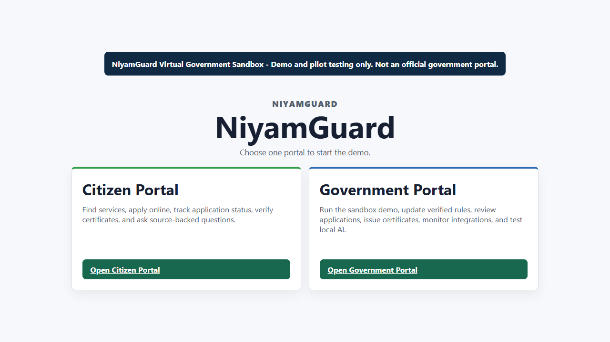

# NiyamGuard AI

> **Status: MVP / Pilot Prototype** — Automated backend and frontend checks pass, while external government and identity integrations remain mocked or sandboxed.

[](docs/demo/demo.webm)

> Watch the locally recorded sandbox overview. It is explicitly a demo and not an official government portal.

[Case study](docs/CASE_STUDY.md) · [Architecture](docs/architecture.md) · [Test evidence](docs/TEST_REPORT.md) · [Interview guide](docs/INTERVIEW_GUIDE.md)

> NiyamGuard AI is a government policy compliance and citizen assistance platform: officials upload a circular once, the system extracts exactly what changed, checks every connected system (portals, SOPs, forms, FAQs) against that change, flags and prioritizes anything out of sync, and gives citizens verified, up-to-date answers and guided help through the same knowledge base - all with a full audit trail.

NiyamGuard AI is a sandbox/pilot prototype. It does not submit real government applications, does not connect to real MeeSeva or department systems, and does not replace official government verification.

## Problem

Government departments issue circulars and GOs that change rules, such as `Income Certificate validity: 12 months -> 6 months`. The dependent systems that citizens and officers use often lag behind: public portals, SOPs, forms, FAQs, and chatbots may keep showing the old rule. NiyamGuard AI demonstrates how one verified knowledge base can detect that drift before citizens are affected.

## Architecture

```text
                    Central Verified Knowledge Base
                    circulars, extracted rules, versions,
                    confidence scores, audit trail
                              |
              +---------------+---------------+
              |                               |
      Government Portal                Citizen Portal
 upload, review, compliance      ask, apply, guided help
```

The implementation uses one FastAPI backend and one React/Vite frontend:

- Backend: `backend/app/main.py`
- Frontend: `frontend/src/app/App.jsx`
- Detailed architecture: `docs/architecture.md`
- Demo script: `DEMO.md`

## Product Modules

### Government Portal

- Circular/document management for GO-138-style uploads and seeded circulars.
- Rule extraction with confidence scores and pending review state.
- Mandatory officer/reviewer approval before a rule becomes verified.
- Verified rule publication and version history.
- Compliance drift detection across mock portal config, SOP, FAQ, and form schema.
- Impact/cascade tracing from circular change to citizen impact.
- Priority dashboard for citizen-impact ranking.
- Connected-system propagation and demo patching.
- Audit trail for uploads, extraction, approval, publication, compliance, citizen answers, and certificates.
- Ollama/local AI explanation of verified context only.

### Citizen Portal

- Government Knowledge Assistant that answers from verified rules and cites source circulars.
- Scheme/Service Finder questionnaire.
- Guided application assistance using the existing voice/form assistant.
- Voice access with safe browser/backend fallback.
- Synthetic service portal with mock application, payment, officer review, certificate generation, tracking, and verification.

## Demo Accounts

```text
admin@niyamguard.local / Admin@12345 / admin
reviewer@niyamguard.local / Reviewer@12345 / reviewer
officer@niyamguard.local / Officer@12345 / officer
viewer@niyamguard.local / Viewer@12345 / viewer
citizen@niyamguard.local / Citizen@12345 / citizen
```

## Local Setup

### Backend: Windows PowerShell

```powershell
cd backend
py -3.12 -m venv .venv
.\.venv\Scripts\Activate.ps1
pip install -r requirements.txt
python -m app.seed_demo
uvicorn app.main:app --reload --port 8010
```

### Backend: macOS/Linux

```bash
cd backend
python3.12 -m venv .venv
source .venv/bin/activate
pip install -r requirements.txt
python -m app.seed_demo
uvicorn app.main:app --reload --port 8010
```

### Frontend: Windows/macOS/Linux

```bash
cd frontend
npm install
npm run dev -- --host 127.0.0.1 --port 5180
```

Open:

```text
http://127.0.0.1:5180
```

## Main Routes

```text
/                       two-portal landing
/citizen                citizen portal
/government             government portal
/demo                   legacy demo dashboard
/services               citizen services
/apply/income_certificate
/applications
/track
/verify-certificate
/officer
/admin
/admin/policy-updates
/admin/compliance
/admin/propagation
/admin/audit
/admin/reports
/admin/readiness
/virtual-gov
/mock/meeseva
/mock/public-faq
```

## Key APIs

```text
POST /api/auth/login
GET  /api/integration/health
GET  /api/dashboard/summary
POST /api/demo/run-full-end-to-end
GET  /api/circulars
POST /api/circulars/{circular_id}/extract-rules
GET  /api/rule-candidates
POST /api/rule-candidates/{candidate_id}/approve
POST /api/policy-updates/{candidate_id}/publish
POST /api/compliance/run
GET  /api/compliance/findings
GET  /api/cascade/finding/{finding_id}
GET  /api/dashboard/priority-findings
GET  /api/audit/events
POST /api/hybrid/answer
GET  /api/public/rules/latest?service_id=income_certificate&rule_key=validity
GET  /api/portal/services
POST /api/applications
GET  /api/officer/pending
POST /api/officer/applications/{application_id}/approve
GET  /api/certificates/verify/{verification_hash}
GET  /api/ai/status
POST /api/ai/verified-explanation
```

## Ollama

Ollama is optional. It is used only to explain verified context; it does not make official policy or compliance decisions.

```bash
ollama pull qwen2.5:7b-instruct
```

Recommended environment:

```env
AI_ENABLED=true
AI_PROVIDER=ollama
OLLAMA_BASE_URL=http://127.0.0.1:11434
OLLAMA_MODEL=qwen2.5:7b-instruct
OLLAMA_FALLBACK_MODEL=llama3.2:3b
RAG_ENABLED=true
```

If Ollama is unavailable, deterministic fallback remains active.

## Tests

Backend:

```bash
python -m pytest backend/app/tests -q
```

Frontend:

```bash
cd frontend
npm test -- --run
npm run build
```

Smoke test with a running backend:

```bash
python scripts/final_api_smoke_test.py --base-url http://127.0.0.1:8010
```

Browser E2E with running backend and frontend:

```bash
cd frontend
npx playwright test tests/e2e/final-full-feature-portal.spec.ts --headed
```

## Docker

```bash
docker compose up --build
docker compose exec backend python -m app.seed_demo
```

Docker runs PostgreSQL, FastAPI, and frontend services using the compose file.

## Seed Data

The default seed includes:

- GO-138: Income Certificate validity `12 months -> 6 months`.
- Mock connected systems that can drift from the verified rule.
- Demo service definitions and forms.
- Demo users and officer/reviewer roles.
- Synthetic dataset pack under `data/niyamguard_dataset_pack_v1`.

The dataset is synthetic. It is useful for demos, RAG/search, tests, and model-prep only.

## Limitations

- This is a sandbox/pilot prototype with mock connected systems and demo data.
- It is not a production integration with real government portals.
- Production would need real APIs, security audit, accessibility audit, legal review, department sign-off, secrets management, real digital signatures, and real operational monitoring.
- The app guides citizens but never submits an official application, handles real OTP/CAPTCHA/payment, or replaces official verification.
